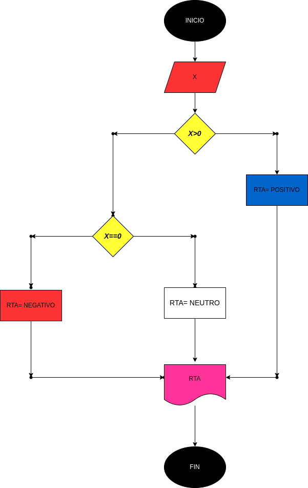

# Ejerccio N.5

## Programa para calcular si un numero es Positivo o Negativo

# ANALISIS

Variabes de entrada (input)

x: Numero ingresado

Variables de proceso y salida (precessing, storage, output)

RTA: Nos va adecir si es POSITIVO o NEGATIVO

# DISEÑO

# CONSTRUCCION
